# Федоров Дмитрий ЛР-3 Лабораторная №1

## Примечание: Проверки ввода в алгоритм решения не попадают, но их работу можно рассмотреть в разделе тестирование.

# Задание 1

## Задача 2

### Текст задачи

Сумма знаков.
Дана сигнатура метода: public int sumLastNums (int x);
Необходимо реализовать метод таким образом, чтобы он возвращал результат
сложения двух последних знаков числах, предполагая, что знаков в числе не
менее двух. 

### Алгоритм решения

1. Вычисляем остаток от деления числа на 10, тем самым получая последний знак.
2. Вычисляем отстаток от деления числа на 100 и делим его нацело на 10, тем самым получая предпоследний знак.
3. Складываем получившиеся знаки.
4. Возвращаем результат.

### Тестирование

Корректный ввод:

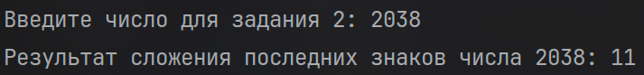

Ввод не целочисленного типа:

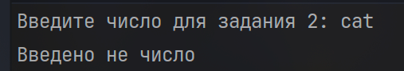

Ввод отрицательного числа:

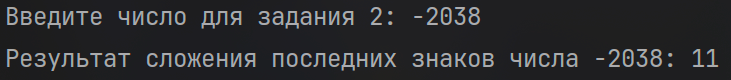

Ввод числа имеющего меньше 2 знаков не тестируется, условие этого не предполагает.

## Задача 4

### Текст задачи

Есть ли позитив.
Дана сигнатура метода: public bool isPositive (int x);
Необходимо реализовать метод таким образом, чтобы он принимал число x и
возвращал true, если оно положительное.

### Алгоритм решения

1. Смотрим больше число нуля или нет, если строго больше нуля, то положительное, иначе не положительное.
2. Возвращаем результат.

### Тестирование

Корректный ввод:

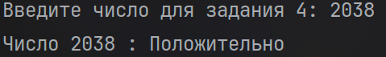

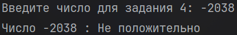

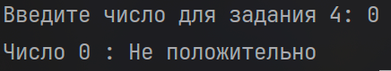

Ввод не целочисленного типа:

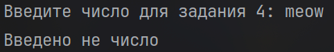

## Задача 6

### Текст задачи

Большая буква.
Дана сигнатура метода: public bool isUpperCase (char x);
Необходимо реализовать метод таким образом, чтобы он принимал символ x и
возвращал true, если это большая буква в диапазоне от ‘A’ до ‘Z’.

### Алгоритм решения

1. Проверяем находится ли введённый символ в диапазоне от A до Z, если да то это большая буква, если нет, то маленькая или вообще не буква.
2. Возвращаем результат.

### Тестирование

Корректный ввод:

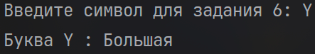

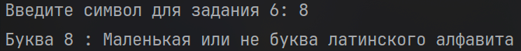

Ввод нескольких символов:

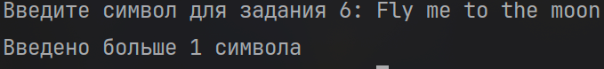

## Задача 8

### Текст задачи

Делитель.
Дана сигнатура метода: public bool isDivisor (int a, int b);
Необходимо реализовать метод таким образом, чтобы он возвращал true, если
любое из принятых чисел делит другое нацело.

### Алгоритм решения

1. Проверяем остаток от деления первого числа на второе и второго числа на первое, если хотя бы в 1 случае остаток равен 0, то одно из чисел делится на другое, в противном случае не делится.
2. Возвращаем результат.

### Тестирование

Корректный ввод:

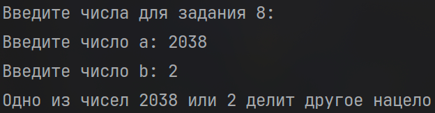

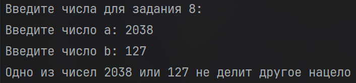

Ввод числа 0:

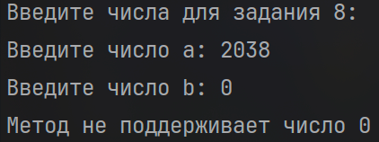

Ввод не целочисленного типа:

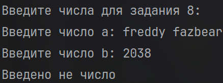

## Задача 10

### Текст задачи

Многократный вызов.
Дана сигнатура метода: public int lastNumSum(int a, int b)
Необходимо реализовать метод таким образом, чтобы он считал сумму цифр
двух чисел из разряда единиц. Выполните с его помощью последовательное
сложение пяти чисел и результат выведите на экран. Постарайтесь выполнить
задачу, используя минимально возможное количество вспомогательных
переменных.

### Алгоритм решения

1. Находим остаток от деления на 10 у первых двух введённых чисел, складываем его и выводим результат на экран.
2. Складываем остаток от деления на 10 от полученной на предыдущем шаге суммы и остаток от деления на 10 текущего введённого числа, результат выводим на экран.
3. Повторяем шаг 2 ещё 3 раза.
4. Выводим итоговый результат.

### Тестирование

Корректный ввод:

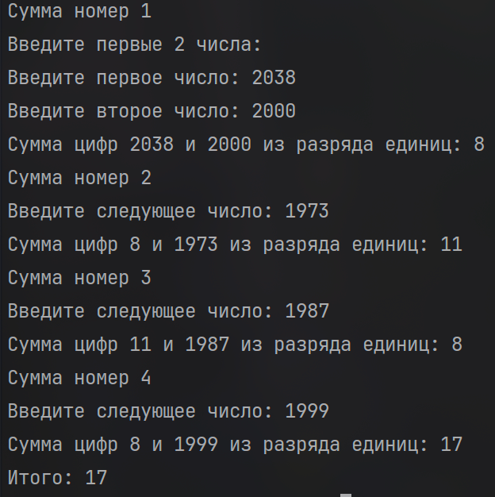

Ввод отрицательного числа:

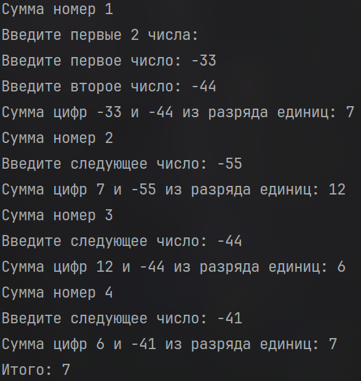

Ввод не целочисленного типа:

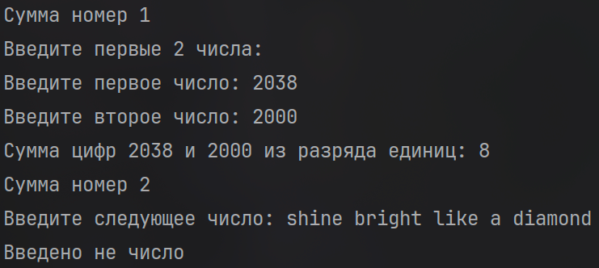

# Задание 2

## Задача 2

### Текст задачи

Безопасное деление.
Дана сигнатура метода: public double safeDiv (int x, int y);
Необходимо реализовать метод таким образом, чтобы он возвращал деление x
на y, и при этом гарантировал, что не будет выкинута ошибка деления на 0. При
делении на 0 следует вернуть из метода число 0.

### Алгоритм решения

1. Проверяем является ли второе число нулём, если да, то возвращаем 0, если нет, то переводим первое число из int в double, делим его на второе и возвращаем результат.

### Тестирование

Корректный ввод:

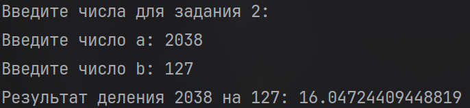

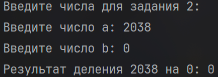

Ввод не целочисленного типа:

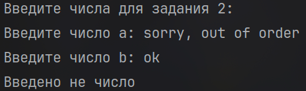

## Задача 4

### Текст задачи

Строка сравнения.
Дана сигнатура метода: public String makeDecision (int x, int y);
Необходимо реализовать метод таким образом, чтобы он возвращал строку,
которая включает два принятых методом числа и корректно выставленный
знак операции сравнения (больше, меньше, или равно).

### Алгоритм решения

1. 2 введённых числа сравниваются между собой, на основе результатов сравнения формируется соответствующая строка.
2. Возвращаем результат.

### Тестирование

Корректный ввод:

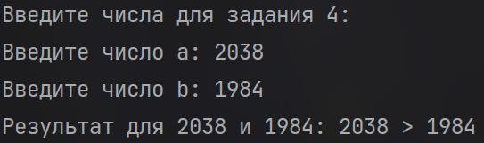

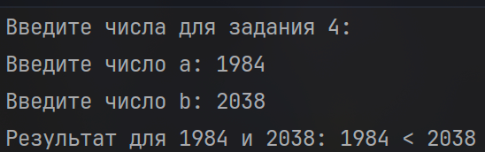

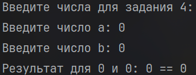

Ввод не целочисленного типа:

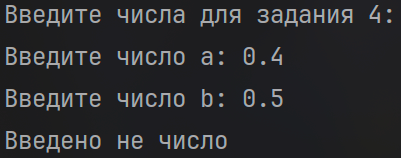

## Задача 6

### Текст задачи

Тройная сумма.
Дана сигнатура метода: public bool sum3 (int x, int y, int z);
Необходимо реализовать метод таким образом, чтобы он возвращал true, если
два любых числа (из трех принятых) можно сложить так, чтобы получить
третье.

### Алгоритм решения

1. Для каждого из 3-x введённых чисел проверяем, равна ли сумма 2-x других введённых чисел этому числу, если проверка пройдена, хотя бы для одного из 3-x чисел, значит 2 любых числа можно сложить так, чтобы получить 3-e, иначе нельзя.
2. Возвращаем результат.

### Тестирование

Корректный ввод:

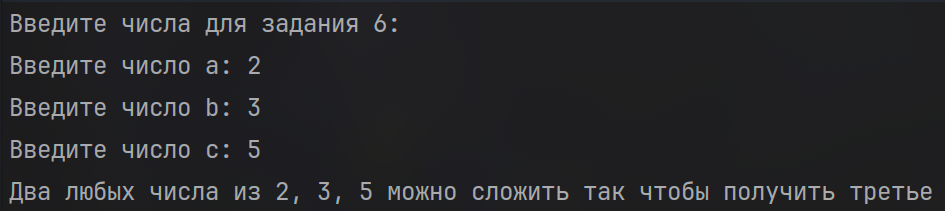

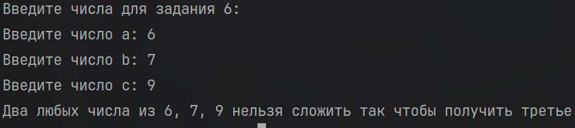

Ввод не целочисленного типа:

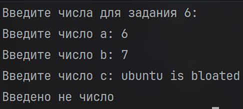

## Задача 8

### Текст задачи

Возраст.
Дана сигнатура метода: public String age (int x);
Необходимо реализовать метод таким образом, чтобы он возвращал строку, в
которой сначала будет число х, а затем одно из слов:
год
года
лет
Слово “год” добавляется, если число х заканчивается на 1, кроме числа 11.
Слово “года” добавляется, если число х заканчивается на 2, 3 или 4, кроме чисел
12, 13, 14.
Слово “лет”добавляется во всех остальных случаях.

### Алгоритм решения

1. Считаем остаток от деления введённого числа на 10, cлово “год” добавляется, остаток равен 1, и само число не 11.
   Слово “года” добавляется, если остаток равен 2, 3 или 4 и если число не равно 12, 13, 14.
   Слово “лет” добавляется во всех остальных случаях.
2. Возвращаем результат.

### Тестирование

Корректный ввод:

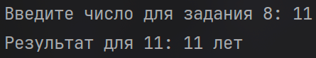

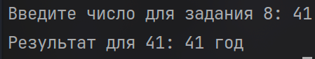

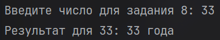

Ввод отрицательного числа:

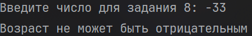

Ввод не целочисленного типа:

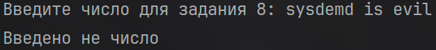

## Задача 10

### Текст задачи

Вывод дней недели.
Дана сигнатура метода: public void printDays (String x);
В качестве параметра метод принимает строку, в которой записано название
дня недели. Необходимо реализовать метод таким образом, чтобы он выводил
на экран название переданного в него дня и всех последующих до конца недели
дней. Если в качестве строки передан не день, то выводится текст “это не день
недели”. Первый день понедельник, последний – воскресенье. Вместо if в данной
задаче используйте switch.

### Алгоритм решения

1. Проверяем день недели и выводим все оставшиеся в дни в неделе после него, если введён не день недели, выводим "это не день недели".

### Тестирование

Корректный ввод:

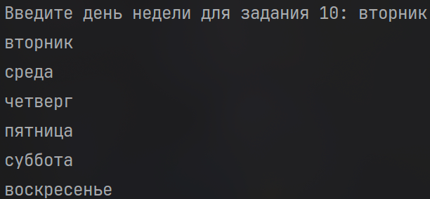

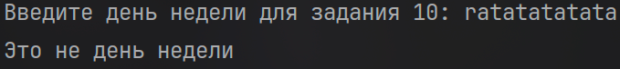

Ввод букв разного регистра:

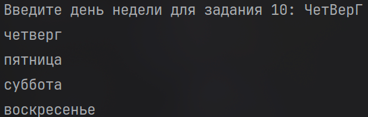

# Задание 3

## Задача 2

### Текст задачи

Числа наоборот.
Дана сигнатура метода: public String reverseListNums (int x);
Необходимо реализовать метод таким образом, чтобы он возвращал строку, в
которой будут записаны все числа от x до 0 (включительно).

### Алгоритм решения

1. Создаём пустую строку. 
2. Запускаем цикл от введённого числа до 0 включительно и в каждой итерации приписываем к строке в конец переменную цикла.
3. Возвращаем полученную строку.

### Тестирование

Корректный ввод:

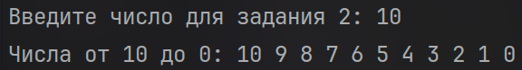

Ввод отрицательного числа:

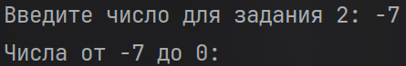

Ввод не целочисленного типа:

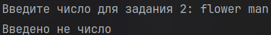

## Задача 4

### Текст задачи

Степень числа.
Дана сигнатура метода: public int pow (int x, int y);
Необходимо реализовать метод таким образом, чтобы он возвращал результат
возведения x в степень y.
Подсказка: для получения степени необходимо умножить единицу на число x, и
сделать это y раз, т.е. два в третьей степени это 1*2*2*2

### Алгоритм решения

1. Создаём переменную с значением 1.
2. Запускаем цикл от значения y до 0 и в каждой итерации умножаем созданную переменную на x.
3. Возвращаем результат.

### Тестирование

Корректный ввод:

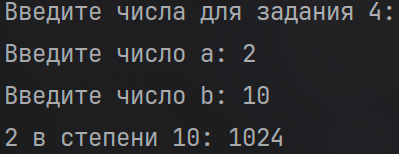

Ввод отрицательного числа в качестве степени:

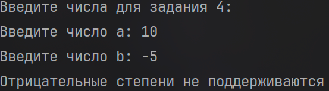

Ввод отрицательного числа в качестве числа, возводимого в степень:

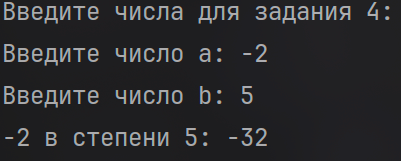

Ввод не целочисленного типа:

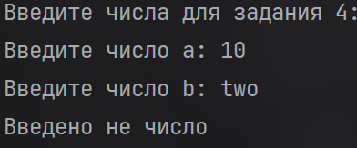

## Задача 6

### Текст задачи

Одинаковость.
Дана сигнатура метода: public bool equalNum (int x);
Необходимо реализовать метод таким образом, чтобы он возвращал true, если
все знаки числа одинаковы, и false в ином случае.

### Алгоритм решения

1. Получаем последний знак введённого числа, вычисляя остаток от деления на 10.
2. Сравниваем текущий последний знак и предыдущий если он существует.
3. Если знаки не совпадают, не все знаки числа одинаковы, можно выходить.
4. Если знаки совпадают или предыдущего знака не существует, делим число нацело на 10.
5. Повторяем шаги 1-4, пока не выйдем на шаге 3 или пока введённое число больше нуля.
6. Если мы вышли после того как число обратилось в 0, значит все цифры одинаковые.
7. Возвращаем результат.

### Тестирование

Корректный ввод:

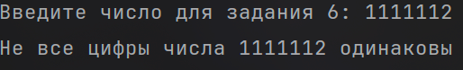

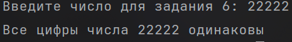

Ввод отрицательного числа:

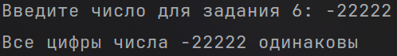

Ввод не числа:

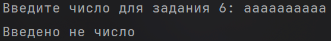

## Задача 8

### Текст задачи

Левый треугольник.
Дана сигнатура метода: public void leftTriangle (int x);
Необходимо реализовать метод таким образом, чтобы он выводил на экран
треугольник из символов ‘*’ у которого х символов в высоту, а количество
символов в ряду совпадает с номером строки.

### Алгоритм решения

1. Создаём пустую строку.
2. Запускаем цикл, который выполняется x раз.
3. В каждой итерации приписываем к строке в конец символ "*" и выводим получившуюся строку на экран.

### Тестирование

Корректный ввод:

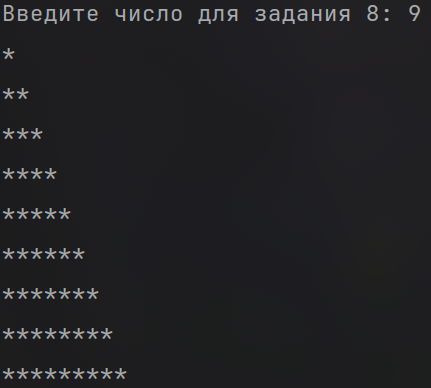

Ввод отрицательного числа:

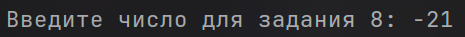
Дальнейший вывод отсутствует.

Ввод не целочисленного типа:

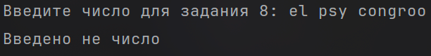

## Задача 10

### Текст задачи

Угадайка.
Дана сигнатура метода: public void guessGame()
Необходимо реализовать метод таким образом, чтобы он генерировал
случайное число от 0 до 9, далее считывал с консоли введенное пользователем
число и выводил, угадал ли пользователь то, что было загадано, или нет. Метод
запускается до тех пор, пока пользователь не угадает число. После этого
выведите на экран количество попыток, которое потребовалось пользователю,
чтобы угадать число.

### Алгоритм решения

1. Создаём генератор случайных чисел, генерируем с его помощью случайное число от 0 до 9 и создаём переменную для подсчёта попыток со значением 1.
2. Запускаем цикл, который выполняется, пока пользователь не угадает число.
3. В каждой итерации считываем с консоли число, введённое пользователем. Если введено не число, выводим сообщение об ошибке и завершаем метод.
4. Сравниваем загаданное число с введённым. Если они равны, выводим сообщение, что число угадано, и количество попыток, потребовавшееся для этого.
5. Если числа не равны, выводим сообщение, что пользователь не угадал, увеличиваем счётчик попыток на 1 и переходим к следующей итерации.

### Тестирование

Корректный ввод:

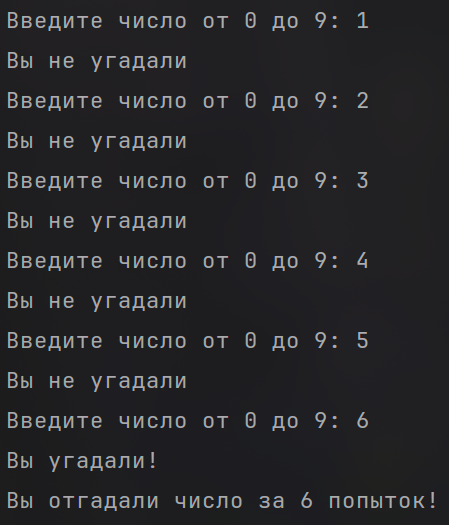

Ввод не целочисленного типа:

# Задание 4

## Задача 2

### Текст задачи

Поиск последнего значения.
Дана сигнатура метода: public int findLast (int[] arr, int x);
Необходимо реализовать метод таким образом, чтобы он возвращал индекс
последнего вхождения числа x в массив arr. Если число не входит в массив –
возвращается -1.

### Алгоритм решения

1. Запускаем цикл по индексам массива от последнего элемента (arr.Length - 1) до 0 включительно.
2. В каждой итерации сравниваем текущий элемент массива с числом x. Если они равны, возвращаем текущий индекс.
3. Если цикл завершился и равного x элемента не нашлось, возвращаем -1.

### Тестирование

Корректный ввод:

Ввод и поиск отрицательного числа:

Ввод не целочисленного типа:

## Задача 4

### Текст задачи

Добавление в массив.
Дана сигнатура метода: public int[]add (int[] arr, int x, int pos);
Необходимо реализовать метод таким образом, чтобы он возвращал новый
массив, который будет содержать все элементы массива arr, однако в позицию
pos будет вставлено значение x.

### Алгоритм решения

1. Создаём новый массив, длина которого на 1 больше длины исходного.
2. Запускаем цикл по индексам нового массива от 0 до его длины не включая её.
3. В каждой итерации смотрим на соотношение текущего индекса и позиции pos. Если индекс меньше pos, копируем в новый массив элемент исходного массива с тем же индексом. Если индекс равен pos, записываем в эту позицию число x. Если индекс больше pos, копируем элемент исходного массива с индексом на 1 меньше, так как все элементы после вставленного сдвигаются вправо.
4. Возвращаем получившийся массив.

### Тестирование

Корректный ввод:

Ввод отрицательного индекса вставки:

Ввод индекса превышающего длину списка:

Ввод не целочисленного типа:

## Задача 6

### Текст задачи

Реверс.
Дана сигнатура метода: public void reverse (int[] arr);
Необходимо реализовать метод таким образом, чтобы он изменял массив arr.
После проведенных изменений массив должен быть записан задом-наперед.

### Алгоритм решения

1. Запускаем цикл по индексам от 0 до половины длины массива не включая её.
2. В каждой итерации меняем местами текущий элемент и элемент, симметричный ему относительно середины массива, то есть элемент с индексом arr.Length - 1 - i.

### Тестирование

Корректный ввод:

Ввод не целочисленного типа:

## Задача 8

### Текст задачи

Объединение.
Дана сигнатура метода: public int[] concat (int[] arr1,int[] arr2);
Необходимо реализовать метод таким образом, чтобы он возвращал новый
массив, в котором сначала идут элементы первого массива (arr1), а затем
второго (arr2).

### Алгоритм решения

1. Создаём новый массив, длина которого равна сумме длин двух исходных массивов.
2. Запускаем цикл по индексам нового массива от 0 до его длины не включая её.
3. В каждой итерации смотрим, меньше ли текущий индекс длины первого массива. Если меньше, копируем в новый массив элемент первого массива с тем же индексом.
4. Если индекс не меньше длины первого массива, копируем элемент второго массива с индексом, равным текущему индексу минус длина первого массива, так как элементы второго массива записываются сразу после элементов первого.
5. Возвращаем получившийся массив.

### Тестирование

Корректный ввод:

Ввод не целочисленного типа:

## Задача 10

### Текст задачи

Удалить негатив.
Дана сигнатура метода: public int[] deleteNegative (int[] arr);
Необходимо реализовать метод таким образом, чтобы он возвращал новый
массив, в котором записаны все элементы массива arr кроме отрицательных.

### Алгоритм решения

1. Запускаем цикл по элементам исходного массива и считаем, сколько среди них отрицательных чисел.
2. Создаём новый массив, длина которого равна длине исходного массива минус количество отрицательных чисел, и переменную для индекса записи в новый массив со значением 0.
3. Запускаем цикл по индексам исходного массива от 0 до его длины не включая её.
4. В каждой итерации проверяем текущий элемент. Если он не отрицательный, записываем его в новый массив по индексу записи. Если отрицательный, уменьшаем индекс записи на 1, чтобы компенсировать увеличение на следующем шаге.
5. В конце итерации увеличиваем индекс записи на 1. Таким образом, для отрицательных элементов индекс записи остаётся прежним, а для остальных сдвигается на следующую позицию.
6. Возвращаем получившийся массив.

### Тестирование

Корректный ввод:

Ввод не целочисленного типа:

